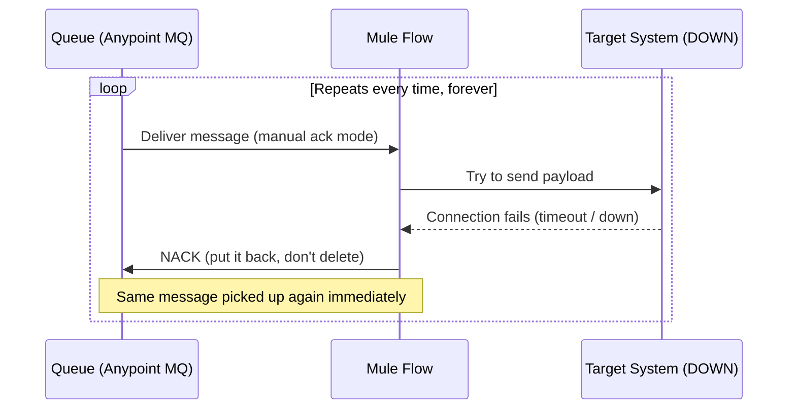
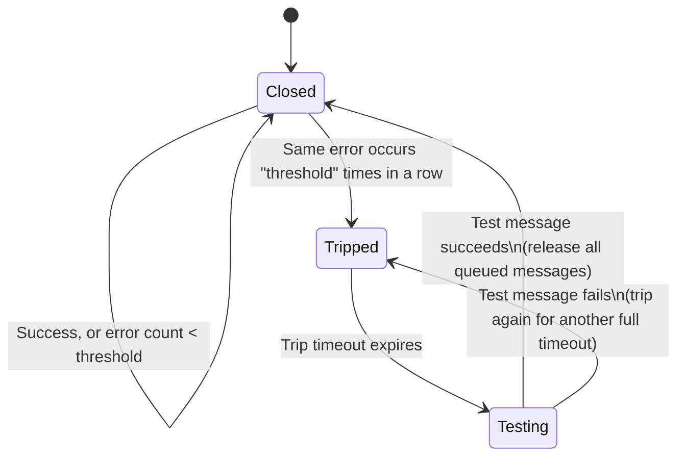
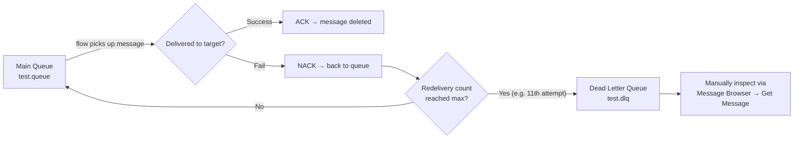

# Apr 01 — Detailed Notes: Circuit Breaker Logic, Dead Letter Queue, Object Store Intro

> **Watch alongside:** this is the day the course covers *"what happens when the system you're sending data to is down, and how do we stop that from breaking everything else."* Three ideas build on each other: **Circuit Breaker** (stop hammering a dead target), **Dead Letter Queue** (stop retrying a message that can never succeed), and a first look at **Object Store** (cache data instead of re-fetching it).

---

## 1. The Problem, First — Why Do We Even Need a Circuit Breaker?

Imagine a simple integration: messages sit in an **Anypoint MQ queue**, and a Mule flow picks each one up and tries to deliver it to a **target system** (some downstream API/database).

Now the target system goes down — say, for scheduled maintenance for 2 hours.

Without any protection, here's what happens, step by step:

- **ACK** = "I successfully delivered this, delete it from the queue."
- **NACK** = "I could not deliver this, please give it back to me (or someone) to retry."

If the flow always NACKs on failure, and the target is down for 2 hours, this loop runs **continuously, at full speed**, for 2 hours straight. Now scale that up:

| Messages in queue | What happens |
|---|---|
| 1 | Wasteful, but harmless |
| 100 | 100 repeated failed calls per cycle |
| 100,000 | Massive number of retries; if each failure also triggers a **notification email**, you just spammed 100,000 emails |

And it's not just wasted network calls — the **Mule application itself** can be harmed:
- Every retry consumes a thread / worker resource.
- If requests pile up faster than your **vCore/Worker** capacity can process them, the app becomes **overloaded**.
- An overloaded app can go from *running* → *unresponsive* → *hung* → **undeployed**.

> 💡 **Mental model:** think of the queue as a customer endlessly redialing a busy phone number, over and over, without ever hanging up to let anyone else use the line. Circuit Breaker is the "please stop dialing for a while" mechanism.

---

## 2. Circuit Breaker Logic — The Fix

Circuit Breaker logic doesn't fix the target system — it protects **your own flow and the target system from being hammered** while the target is down, by *deliberately pausing* message consumption for a while.

### The 3 configuration knobs

| Setting | What it means | Example |
|---|---|---|
| **Error Type(s)** | Which specific error(s) count towards tripping the breaker. Comma-separated. | `HTTP:TIMEOUT`, `HTTP:CONNECTIVITY` |
| **Threshold** | How many times the *same* error must occur **consecutively** before the flow trips | `5` |
| **Trip Timeout** | How long the flow stays "tripped" (paused) once threshold is hit | `5 minutes` |

### How the state machine actually behaves

- **Closed** = normal state, messages flow through as usual.
- **Tripped** = breaker is "open" — the flow stops consuming new messages for the `trip timeout` duration. (Note: MuleSoft docs call the tripped state simply "open"/"tripped" rather than the classic Hystrix-style "half-open," but the *behavior* below matches the half-open pattern conceptually.)
- **Testing** = after the timeout, exactly **one** message is released as a probe.
  - ✅ Probe succeeds → **all** other queued messages are released, breaker goes back to Closed.
  - ❌ Probe fails → breaker trips again for another full `trip timeout` period.

### Worked example

> Threshold = 5, Trip Timeout = 5 minutes, error type = `HTTP:CONNECTIVITY`.
>
> 1. Target goes down. First 5 messages each fail with `HTTP:CONNECTIVITY`.
> 2. On the 5th consecutive failure, the **flow trips** — it stops pulling new messages from the queue.
> 3. For the next 5 minutes, **nothing** is pulled from the queue, even if there are 10,000 messages waiting.
> 4. After 5 minutes, **one** message is picked and tried.
>    - If it succeeds (target is back up) → the rest of the queue drains normally.
>    - If it fails again → another 5-minute pause begins.

**Important:** only the *error types you explicitly configured* count toward the threshold. Any other/unexpected error type is not controlled by the breaker — it runs through the normal error-handling path instead.

### What Circuit Breaker does *not* solve

If the problem isn't "target is down" but "**this specific message is garbage and will never succeed**" (e.g. malformed JSON that always fails validation), retrying it — even in a controlled, paced way — is still pointless. That's the motivation for the next concept.

---

## 3. Dead Letter Queue (DLQ)

**Idea:** give every message a maximum number of tries. If it still fails after that many attempts, stop retrying it and move it somewhere safe for a human to inspect later — instead of endlessly recycling it *or* silently dropping it.

### Setup
- Bind a second queue to your main queue and mark it as the **Dead Letter Queue**. Example: `test.queue` → bound DLQ `test.dlq`.
- Set **Max Re-delivery Attempts** (default = **10**).
- Behavior: the message can be redelivered up to the max count; on the **next** attempt after that (the 11th, if max=10), it is:
  - Removed from the main queue.
  - Pushed into the DLQ instead.

### Inspecting the DLQ
Once a bad message lands in the DLQ, you can open it in Anypoint Platform (**Message Browser → Get Message**) to see exactly what payload caused the failure — useful for debugging data-quality issues at the source, or for manually resubmitting a fixed version.

### ⚠️ Common confusion: Threshold vs. Max Re-delivery Attempts
These sound similar but operate at **completely different levels**:

| | Circuit Breaker **Threshold** | DLQ **Max Re-delivery Attempts** |
|---|---|---|
| Scope | The **entire flow** | **One specific message** |
| Counts | Consecutive occurrences of the *same error type*, across any messages | How many times *this particular message* has been redelivered |
| Effect when hit | Flow **pauses** for `trip timeout` | *That message* moves to the **DLQ** |

**Worked disambiguation example:** Max redelivery = 10, Threshold = 5.
- The flow will **trip** after the 5th consecutive matching error — regardless of which message caused each failure.
- A single message's redelivery counter keeps incrementing across trips; once *that message specifically* hits 10 redeliveries, it goes to the DLQ — independent of how many times the whole flow has tripped and resumed along the way.

> 🧠 **Interview tip:** if asked to explain Circuit Breaker + DLQ together, always draw this distinction explicitly — flow-level pacing vs. message-level giving-up. Interviewers use this specifically to check if you actually understand it or just memorized the terms.

---

## 4. Teaser: Object Store

Before wrapping up, the instructor introduces the next topic (fully covered on **Apr 07**, see `apr07.md`):

- **Object Store** is a connector/component that lets you store data **inside the Mule runtime itself** — a simple key-value cache.
- Question posed: *"What connectors have we used so far?"*
  1. HTTP (Request + Listener)
  2. Anypoint MQ
  3. *(next)* **Object Store**

---

## 5. Task Assigned (hands-on, do this while/after watching)

Implement Circuit Breaker end-to-end using **manual ACK/NACK**:
1. Publish ~10 messages to a queue.
2. Point the flow at a deliberately invalid/unreachable target so every call fails.
3. Read the **real** error type from the console/logs (don't guess it).
4. Configure that exact error type in the Circuit Breaker, with threshold = 5 or 10 and trip timeout = 5 minutes (practice values).
5. Observe: confirm the flow actually trips and pauses; confirm DLQ picks up messages once they exceed max redelivery attempts.

> Why this matters: this is described as a very commonly asked, detailed interview question — you need to be able to explain **and demo** it end-to-end, not just describe it in the abstract.

---

## Quick Recap

- **Circuit Breaker** = pace-limiter for the **flow** — stops hammering a target after repeated identical errors, waits, then probes with one message before resuming.
- **DLQ** = safety net for a **specific bad message** — after N redelivery attempts, it's set aside instead of retried forever.
- These two mechanisms are independent counters solving two different problems (system-down vs. message-is-bad) and are often used **together**.
- **Object Store** is coming next — a way to avoid needless repeated calls to external systems for data that rarely changes.
