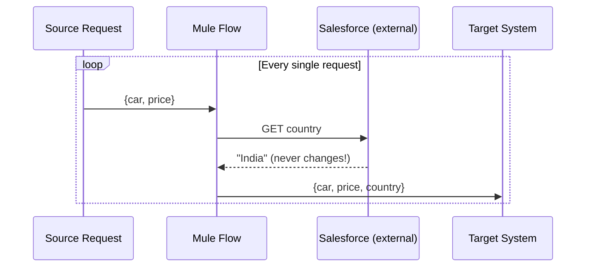
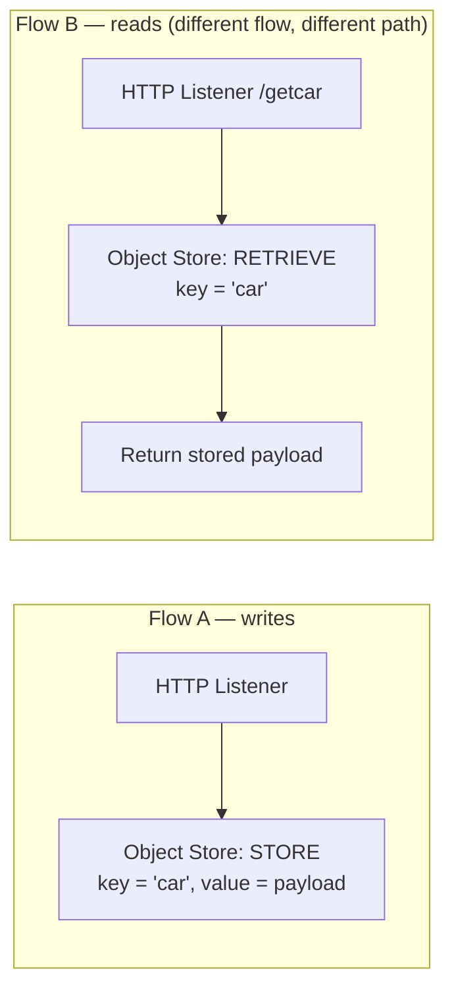
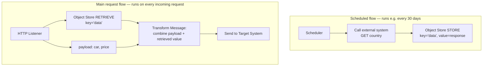
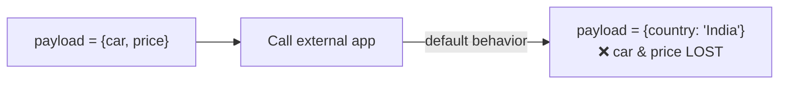
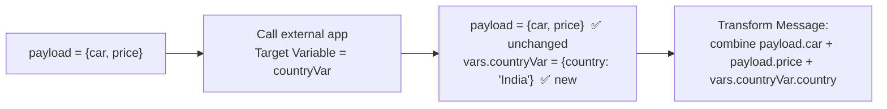

# Apr 07 — Detailed Notes: Object Store Deep Dive

> **Watch alongside:** this day is entirely about **Object Store** — Mule's built-in key-value cache. By the end you should be able to explain *why* it exists, *when* to use it over Anypoint MQ, and build the classic "cache static data instead of re-fetching it" pattern from scratch.

---

## 1. The Core Problem Object Store Solves

Imagine a flow that, on every incoming request, needs to combine:
- **Dynamic data** from the current request (e.g. `car`, `price` — different every time).
- **Static/reference data** from an external system (e.g. Salesforce returns `country: "India"` — basically never changes).

**Naive approach:**

This calls Salesforce **on every single request**, even though `country` is always `"India"`. If you get 1,000 requests, that's 1,000 identical, wasted calls — and if Salesforce has a brief outage, your **entire flow fails**, even though the only reason you needed Salesforce was for a value that hasn't changed in months.

**Object Store's answer:** fetch the static value *once* (or on a schedule), cache it inside Mule, and read from the cache instead of calling Salesforce every time.

---

## 2. Object Store vs. Anypoint MQ — Know These Numbers Cold

| | Anypoint MQ | Object Store |
|---|---|---|
| Max payload size | 10 MB | 10 MB (same) |
| Max retention | **7 days** | **30 days** (default, configurable) |
| Memory | — | Consumes **runtime memory** of the worker |
| Purpose | Message queueing / decoupling | Key-value **caching** inside Mule |

Both share the 10MB payload ceiling — that's an easy interview gotcha to remember. The big difference is retention (7 vs. 30 days) and the fact that Object Store literally lives in the worker's memory, so it has a direct cost/limit tied to your app's memory allocation.

---

## 3. Object Store Operations

| Operation | What it does |
|---|---|
| **Store** | Save a value under a key |
| **Retrieve** | Read a value back by key |
| **Remove** | Delete one specific key |
| **Retrieve All Keys** | List every key currently stored |
| **Contains** | Check if a key exists (boolean) |
| **Clear** | Wipe everything |

Think of it as a simple dictionary/hash map: `store(key, value)` and `retrieve(key) → value`.

Key details from the hands-on demo:
- Retention/TTL is configurable per store operation — default **30 days** if unset, but you can set it to 1 day, 2 days, 10 days, etc. based on business need.
- Store/Retrieve work **across different flows, and even different applications** in the same org, as long as they use the **same key name** — because the data lives in a shared runtime-level store. Using distinct, well-namespaced keys avoids accidental collisions between unrelated data.

> ⚠️ **Gotcha demonstrated live:** after retrieving from Object Store, you still need to hit **Confirm** on the config for it to actually apply — an easy step to miss when building this for the first time.

---

## 4. The Real-World Caching Pattern (the important part)

This is the pattern to actually internalize — it shows up constantly in integration work.

**Requirement:** combine `car` + `price` (from the live request) with `country` (static, from an external system) and send all three to a target system — **without** calling the external system on every request.

**Why this works:**
- The external system (Salesforce) is now called **once per schedule interval** (e.g. every 30 days — matching Object Store's default retention) instead of once per request.
- If Salesforce has a brief outage, the main request flow is **unaffected** — it just reads the last cached value.
- The 30-day schedule and the 30-day default Object Store TTL are chosen to line up, so the cached value never "expires" before it's refreshed.

> 💡 **Rule of thumb:** if a piece of data rarely changes, don't fetch it live on every request — fetch it on a schedule, cache it, and read the cache. This single pattern is one of the most reusable ideas in the entire course.

---

## 5. Hands-On Walkthrough (what was actually built)

1. Built Flow 1: `HTTP Listener → Object Store STORE (key = "car")` — POSTing `{car, price}` stores the whole payload.
2. Built Flow 2: `HTTP Listener (/getcar) → Object Store RETRIEVE (key = "car")` — a GET with **no body** returns the previously stored payload.
3. Verified: POST once to store, then GET repeatedly from a different endpoint with no input — the same data comes back every time, proving persistence across requests without needing the original caller to resend anything.
4. Extended to the full 3-field scenario: source system gives `car` + `price`; a separate scheduled flow caches `country` from an external app; the main flow merges both sources via Transform Message before sending to the target.

---

## 6. The Payload-Overwrite Trap (and how Target Variable fixes it)

Here's a bug almost everyone hits the first time they call a second connector mid-flow.

**Scenario:** your flow already has `payload = {car, price}` from the source system. You now call an external app to get `country`. By default, **the connector's response overwrites `payload`** — so by the time you reach Transform Message, `car` and `price` are *gone*, replaced entirely by `{country: "India"}`.

### The fix: Target Variable

On the connector's **Advanced** tab, set a **Target Variable** name (e.g. `countryVar`). This tells Mule: *"put this response into a named variable instead of overwriting payload."*

Now both pieces of data are available side by side, and Transform Message can freely combine `payload.car`, `payload.price`, and `vars.countryVar.country` into one output.

> 🧠 This is one of the single most common real-world Mule bugs for beginners — "why did my original payload disappear?" — so understanding Target Variable cold is high-value both for interviews and for your own debugging sanity.

---

## 7. Terminology: Mule 3 → Mule 4 (memorize this table)

| Mule 3 term | Mule 4 term |
|---|---|
| Message Enricher | **Target Variable** |
| Secure Property Placeholder | Secure Property (Config) |
| Poll scope | **Scheduler** |
| Inbound / Outbound Properties | Unified `attributes` |
| Multiple variable types | Single `flow variable` (`vars`) |

These naming changes come up **constantly** in interviews as a way to test whether you actually have Mule 3 background or only know Mule 4.

---

## 8. Object Store `persistent` Flag — First Mention

Briefly introduced here (fully explained on **Apr 08**, see `apr08.md`): Object Store has a **Persistent** checkbox that controls whether cached data survives the application going into an unresponsive/undeployed state. Without it, a crash or redeploy wipes your cache.

---

## 9. Why MUnit? (motivation, before the hands-on in `apr08.md`)

Testing a flow by hitting it with Postman sends **real requests to real systems** every time. If you're testing repeatedly (which you will be, while developing), that means:
- Real load on a target system that may not want thousands of test calls.
- No way to test *specific failure scenarios* on demand (you can't easily force a real system to return a specific error).

**MUnit** solves this by letting you **mock connectors** (intercept them so no real call happens) and inject **expected test payloads** directly into the flow via a component called **Set Event** — so you can test your flow's internal logic in complete isolation.

---

## Quick Recap

- Object Store = a **key-value cache living inside the Mule runtime**, up to 30 days retention (configurable), 10MB payload cap (same as MQ), consumes runtime memory.
- **Operations:** Store, Retrieve, Remove, Retrieve All Keys, Contains, Clear.
- **Core use case:** cache **static/reference data** so you don't call an external system on every request — refresh it on a schedule instead.
- Works across flows and apps in the same org via shared key names — use distinct keys to avoid collisions.
- **Target Variable** prevents a second connector call from silently overwriting your original `payload` — store its response in a named variable instead.
- Know the **Mule 3 → Mule 4** terminology table cold — it's a favorite interview trap.
- **MUnit** exists to test flow logic without hitting real source/target systems — full hands-on build is in `apr08.md`.
