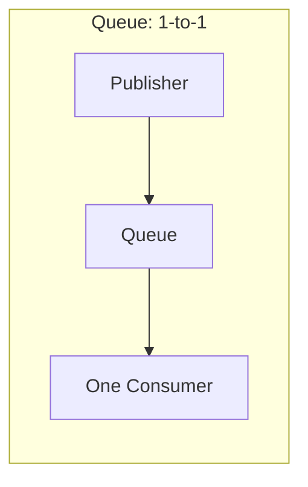
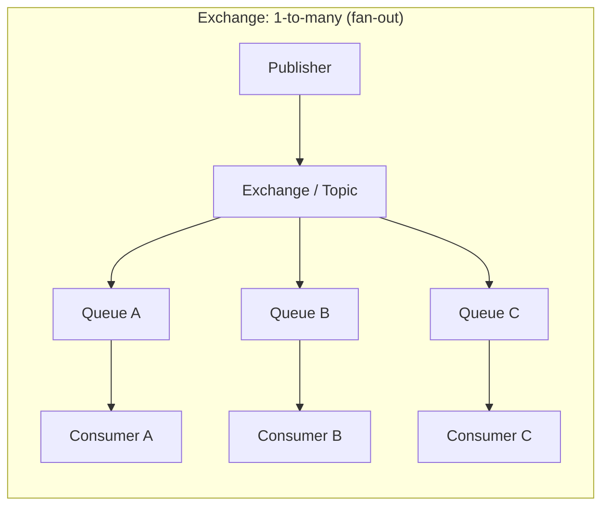
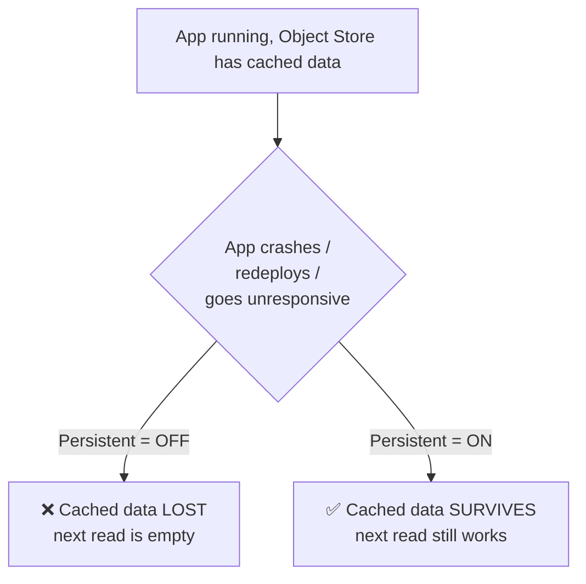
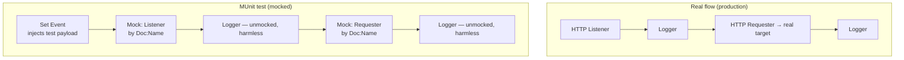

# Apr 08 — Detailed Notes: Queue vs Exchange, Object Store Persistence, Scaling, DataWeave, Hands-On MUnit

> **Watch alongside:** a dense, high-value day — covers the Queue/Exchange fan-out model, finally explains **why** the Object Store `persistent` flag matters, connects app crashes to **scaling** concepts, gives two DataWeave operators, and then builds a **complete MUnit test suite from scratch** hands-on.

---

## 1. Queue vs. Exchange — One-to-One vs. One-to-Many

| | Queue | Exchange (a.k.a. Topic) |
|---|---|---|
| Delivery model | **1-to-1** | **1-to-many** (pub/sub / fan-out) |
| Use when | One consumer should process each message | Multiple consumers each need their own copy |





- Both **Queue** and **Exchange** are created in the **Anypoint MQ** section of Anypoint Platform.
- An Exchange has a **Bind** option — you can bind **N queues to one exchange**, so every published message fans out to all bound queues, each with its own independent consumer.
- To fan a message out to multiple *targets in your own flow* (rather than multiple external queues), use **Scatter-Gather** (parallel) or **Round-Robin** (sequential) — same one-to-many idea, applied inside a single flow instead of at the MQ layer.

---

## 2. Object Store `Persistent` — Fully Explained (the "why" from Apr 07)

Recall: Object Store data normally lives in the worker's **runtime memory**.

**The problem:** if the app crashes, redeploys, or otherwise goes into an **unresponsive/undeployed state**, all that in-memory cached data is **gone**. Your carefully-built "cache static data" pattern from Apr 07 silently breaks the moment the app restarts.

**The fix:** check the **Persistent** box on the Object Store config. This makes the stored data **survive** app restarts/redeploys.



> ✅ **Practical rule:** basically always enable **Persistent** for Object Store unless you have a specific reason the cache should reset on restart.

### Why does an app crash / go unresponsive in the first place?

This connects directly to **scaling**:

| Symptom | Root cause | Fix |
|---|---|---|
| One request has a huge payload | Not enough memory per worker | **Vertical scaling** — increase **vCore** |
| Too many concurrent requests | Not enough workers to share the load | **Horizontal scaling** — increase **Worker** count |

- **vCore** ≈ how much compute/memory *one* worker has (e.g. 0.1 vCore ≈ 500MB guaranteed memory; 0.2 vCore ≈ more).
- **Worker** ≈ how many parallel instances of your app are running to split incoming load.

If load exceeds what your current vCore/Worker configuration can handle, the app can exceed its resource guarantee and tip into an unresponsive/undeployed state — exactly the moment where non-persistent Object Store data would vanish. This is why these two topics (scaling + Object Store persistence) are taught together.

---

## 3. How to Structure an Interview Answer (process/deployment topics)

A recommended order for walking an interviewer through "how does your deployment work":
1. Overall experience summary
2. **Scaling** (vertical vCore vs. horizontal Worker)
3. "Qualities" — non-functional aspects: reliability, throttling
4. **Throttling / rate limiting**
5. **API Manager & Auto-Discovery** — how a published API (from Exchange) gets linked to Runtime Manager so a deployed app becomes an actively policy-managed API
6. Collections/Fragments (covered later, see `apr25.md`)

---

## 4. DataWeave: `map` and `splitBy`

### `map` — reshape every item in an array
Example: input array of objects with `firstName` / `lastName`; output needs one combined `name` field.

```dataweave
%dw 2.0
output application/json
---
payload map (item) -> {
  name: item.firstName ++ " " ++ item.lastName
}
```
- `map` iterates the array; `$` is shorthand for "current item" inside a lambda.
- `++` concatenates strings.

### `splitBy` — break a string apart
Example: input has one combined `name` field (`"Lokesh Karbandi"`), but the target only wants the **first word**.

```dataweave
%dw 2.0
output application/json
---
(payload.name splitBy " ")[0]
```
- `splitBy " "` turns `"Lokesh Karbandi"` into `["Lokesh", "Karbandi"]`.
- `[0]` indexes the array to grab just the first element.

---

## 5. Deployment Terminology

- Apps are deployed to **CloudHub**, managed via **Runtime Manager**.
- Correct interview answer to *"where do you deploy?"* is **"CloudHub"** — not the generic "AWS" or "the cloud" (CloudHub runs on AWS under the hood, but the platform-level answer expected is CloudHub).

---

## 6. Hands-On: Building a Complete MUnit Test Suite

This is the practical payoff of everything MUnit-related discussed so far.

### Step 1 — Generate the test suite
Right-click your flow → **MUnit → Create Blank Test Suite**. This auto-generates a file under `src/test/munit`.

### Step 2 — Mock every connector
Identify how many **connectors** (not just components) are in the flow. Example: a Listener + a Requester = 2 connectors, so you need 2 **Mock** steps.



**Critical detail — mock by `Doc:Name`, never `Doc:Id`:**

| | `Doc:Name` | `Doc:Id` |
|---|---|---|
| What it is | The stable, human-assigned display name (e.g. "Salesforce App") | An internal identifier |
| Stability | Stays the same unless you rename it | **Regenerates** if you delete and re-drag the same connector |
| Recommendation | ✅ Always mock by this | ❌ Avoid — a future accidental re-drag silently breaks your test |

> Logger and Transform Message don't need mocking — Logger has no real side-effect, and Transform Message just needs real input data (which you supply via Set Event).

### Step 3 — Inject test data with Set Event
Since a mocked flow has no real trigger, drag a **Set Event** component to the start of the test and manually configure:
- The exact payload the flow expects (e.g. sample JSON).
- The correct **metadata/MIME type** (e.g. `application/json`) — this has to be set manually, it won't be inferred.

### Step 4 — Run and validate
Run the suite in debug mode. Step through: Set Event supplies the payload → mocked connectors return without touching real systems → Logger prints intermediate values → Transform Message combines fields as expected → assertion passes (green ✅) or fails (red ❌).

### Debugging note from the live demo
Hit an **"Address already in use"** error — caused by multiple Mule apps running on the same port simultaneously. Fix: stop other running apps and/or restart Anypoint Studio.

> 🧠 **Key takeaway:** MUnit validates your flow's *internal logic* in complete isolation — no real source or target system is ever touched — by combining **Mock** (stop real calls, matched by stable Doc:Name) with **Set Event** (inject the test data a real trigger would have provided).

---

## Quick Recap

- **Queue = 1-to-1. Exchange = 1-to-many** (bind N queues to one exchange for fan-out).
- **Object Store `Persistent`** = survives app crash/redeploy; without it, cached data is lost the moment the app goes unresponsive.
- App unresponsiveness ties directly to **scaling**: vCore (vertical, per-worker capacity) vs. Worker count (horizontal, concurrency).
- DataWeave `map` reshapes arrays; `splitBy` splits strings into arrays you can index into.
- Apps deploy to **CloudHub** via **Runtime Manager**.
- MUnit workflow: **Create Blank Test Suite → Mock every connector (by Doc:Name) → Set Event to inject test payload → run and check green/red**.
