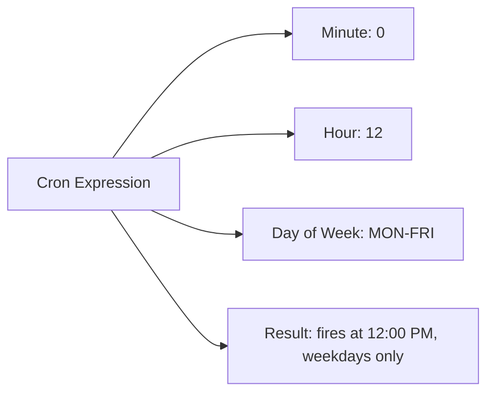
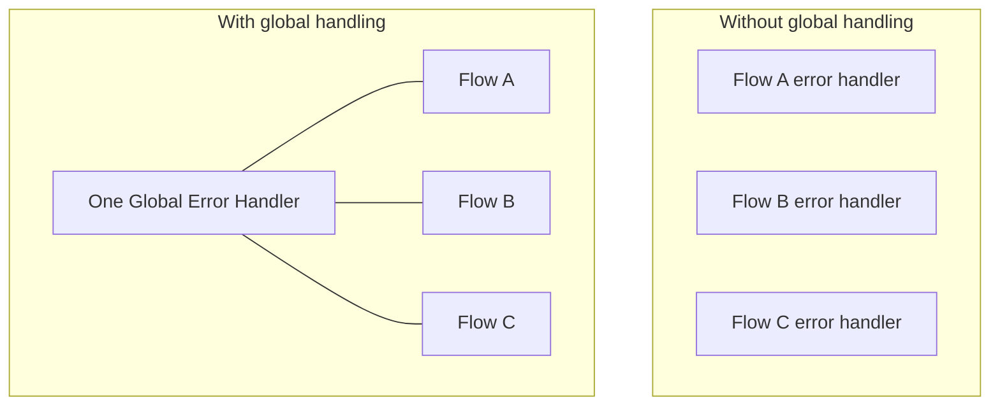
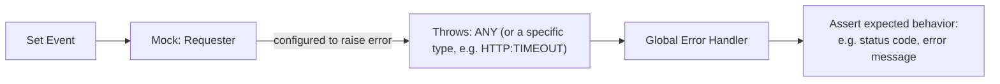

# Apr 11 — Detailed Notes: Mock Interview Recap, DataWeave Practice, Global Error Handling

> **Watch alongside:** this day is a checkpoint — a mock interview debrief consolidating everything so far, a set of DataWeave practice problems worth actually typing out yourself, and a meaningful new concept: **testing your error-handling logic**, not just your happy path, with MUnit.

---

## 1. Mock Interview Debrief

### Policies applied to APIs
- **Client ID Enforcement** — secures API access via a client ID/secret pair.
- **Basic Authentication** — username/password-based auth policy.

### Anypoint MQ — where things live
- Queues and Exchanges are both created in **Anypoint Platform** (MQ section).
- Be ready to **demo live**: create a Queue, create an Exchange, bind multiple Queues to one Exchange. Interviewers may specifically ask you to screen-share this.

### Recap: handling a queued message when the target is down
1. Subscribe in **manual** acknowledgment mode.
2. Success → **ACK** (removes message from queue).
3. Failure → **NACK** (message stays, gets redelivered) — this is the behavior that Circuit Breaker (see `apr01.md`) is built to control.

---

## 2. DataWeave Practice Problems (type these out yourself!)

### Problem 1 — Filter by a field value
*"Show only employees who belong to Bangalore."*
```dataweave
%dw 2.0
output application/json
---
payload filter ($.city == "Bangalore")
```

### Problem 2 — Concatenate two fields into one
*"Combine name and ID into a single field."*
```dataweave
%dw 2.0
output application/json
---
payload map (item) -> {
  nameId: item.name ++ item.id
}
```

### Problem 3 — Extract the first N characters
*"Get the first 4 characters of a string."*
```dataweave
%dw 2.0
output application/json
---
payload.name[0 to 3]
```
Range indexing (`[0 to 3]`) grabs characters at positions 0, 1, 2, 3 — i.e. the first 4.

### Problem 4 — Remove duplicates
*"The business doesn't want duplicate records."*
```dataweave
%dw 2.0
output application/json
---
payload distinctBy ($.someField)
```
`distinctBy` keeps only the first occurrence of each unique value of the given field, dropping the rest.

> 🧠 **How to approach any DataWeave interview question:** ask yourself — is this a *filter* (keep some, drop others)? A *shape change* (map)? A *substring/range* extraction? A *dedupe*? Naming the right category out loud, before writing code, shows structured thinking even if you fumble the exact syntax.

---

## 3. Cron Expression Exercise

**Requirement:** run a scheduler **only Mon–Fri, at 12:00 PM** (not weekends).



Example cron expression shape: `0 0 12 ? * MON-FRI`
(seconds=0, minutes=0, hour=12, day-of-month=any, month=any, day-of-week=Mon–Fri)

> Interview framing: be able to **construct** a cron expression live from a plain-English requirement, not just recognize one you're shown.

---

## 4. Global Error Handling + Testing Error Paths with MUnit

Up to now (`apr08.md`), MUnit tests covered the **happy path**. This session extends that to test **failure/exception behavior** deliberately.

### Setting up a Global Error Handler
Instead of repeating error-handling logic in every flow, define a **Global Configuration** for error handling — one reusable, project-wide handler.



### Testing error paths in MUnit
The trick: use the mocked connector's **"Error"** option to deliberately **raise an error** instead of returning a normal mocked success response.



- Raise a generic **ANY** error to test a catch-all global handler.
- Raise a **specific** error type (e.g. `HTTP:TIMEOUT`, `HTTP:CONNECTIVITY`) if your global config routes different error types to different handling branches.
- Build **one MUnit suite per meaningful error scenario** — this is how you achieve real coverage of your error-handling logic, not just your success path.
- Run all suites: right-click `src/test/munit` → **MUnit → Run Tests**, and check the reported coverage %.

### Q&A clarifications from the class
- **Can you raise an error from the Listener/source side?** No — errors can only be deliberately raised/mocked at the **connector/project level** (e.g. on a Requester), not from the Listener.
- **If a connector is mocked, is it still "connected" for coverage purposes?** Yes — mocking intercepts the *call*, not the *flow structure*. MUnit still counts the mocked connector as part of the executed path when calculating coverage.

---

## Quick Recap

- Interview readiness checklist reinforced: Policies, MQ (create Queue/Exchange live), Circuit Breaker, DataWeave.
- DataWeave essentials practiced: `filter`, `map` + `++`, range indexing `[0 to 3]`, `distinctBy`.
- Cron expressions: be able to build one from a plain-English schedule requirement.
- **Global Error Handling** = one reusable error handler for the whole project instead of per-flow duplication.
- **Testing error paths** in MUnit: mock a connector's **Error** option to deliberately raise ANY or a specific error type, and assert the global handler behaves correctly — build a separate test suite per error scenario for full coverage.
