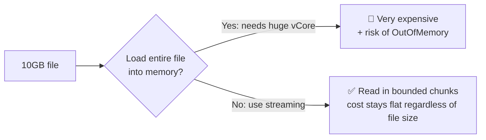
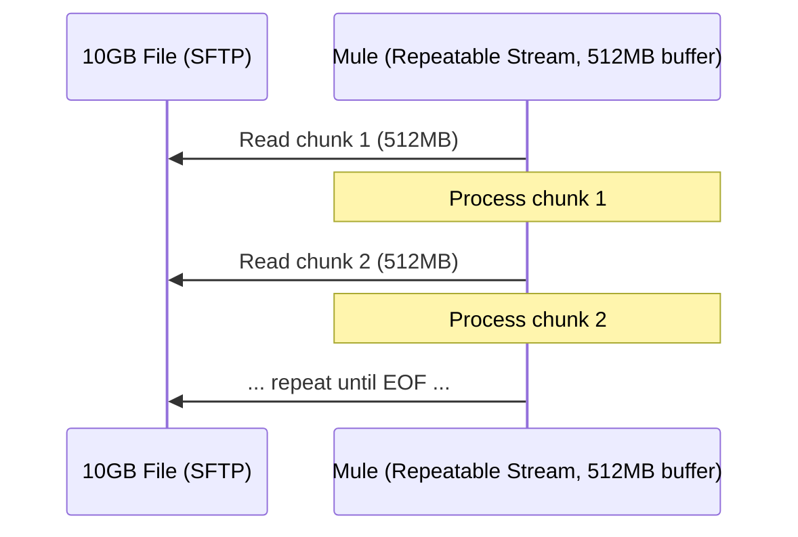
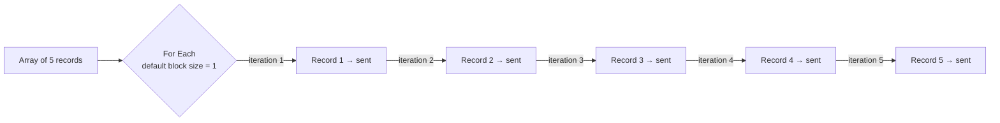
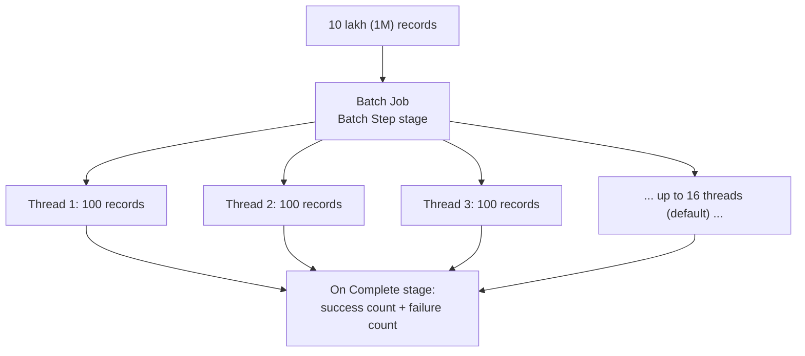

# Apr 13 — Detailed Notes: Streaming Strategies, Batch Job vs. For Each

> **Watch alongside:** this day solves two *related but distinct* scaling problems — reading a file too big to fit in memory, and sending data to a target system that can't accept it all at once. Both hands-on tasks are worth actually building, not just watching.

---

## 1. Problem #1: Reading a File That's Bigger Than Memory

**Scenario walked through:** read a file from SFTP and send it to a target API. The instructor escalates the file size live — 2GB → 10GB → 20GB — to make the cost problem visceral.

### The naive (bad) fix: just add more memory
More **vCore** = more memory per worker, so in theory you could just scale up until the whole file fits in RAM.

**Why this fails in practice:** vCore is billed. Scaling enough to comfortably hold a 10–20GB file in memory, per request, gets **extremely expensive** at production pricing — explicitly called out as a "no business will pay for this" scenario in the lecture.

### The real fix: Streaming Strategies

On the File/SFTP connector's **Advanced → Streaming Strategy** setting:

| Strategy | Behavior |
|---|---|
| **Non-repeatable** | Reads forward-only, once. Lower overhead, but the stream can't be replayed if something downstream needs to re-read it. |
| **Repeatable** | Reads in **chunks**, controlled by a **buffer size** (e.g. `512MB`). Pulls one buffer's worth, processes it, pulls the next, etc. Can be re-read/replayed if needed. |

**Result:** memory usage is bounded by the **buffer size**, not the file size — you can process a 100GB file with the same memory footprint as a 1GB file, just more chunks. This directly avoids **Out Of Memory exceptions**.

---

## 2. Problem #2: The Target System Can't Accept What You Just Read

Even after successfully streaming in, say, 1GB of data, the **target system** might cap incoming requests at something much smaller — e.g. **100MB per request**. You can't just forward the full 1GB in one call.

**Solution: chunk it before sending**, using one of two components.

### For Each — sequential, one at a time

- **Single-threaded**, strictly sequential — record 1 fully finishes before record 2 starts.
- Default block size = **1** (one record per loop iteration).
- Best for **small volumes** (low thousands) where simplicity matters more than raw speed.

### Batch Job — parallel, in configurable chunks

- Runs on a pool of **16 threads by default** (configurable).
- **Configurable block/batch size** (e.g. 100 records per batch).
- **Three stages:**
  1. **Batch Step** — the actual per-record processing logic (transform, send to target, etc.)
  2. **Batch Job / Process stage** — loads and distributes records across the thread pool.
  3. **On Complete** — reports aggregate results *only*: count of successes, count of failures. No other real functionality lives here.

### Speed comparison (the number that matters)
> Instructor's example: **~10 lakh (1 million) records** processed via **Batch Job** in **2–3 minutes**, versus **over an hour** via **For Each** — because Batch runs 16-way in parallel while For Each is strictly single-threaded sequential.

### Decision table

| Volume | Use |
|---|---|
| Small (up to ~thousands) | **For Each** |
| Large (lakhs / millions) | **Batch Job** |

---

## 3. Hands-On Tasks (build both — the contrast is the whole point)

### Task 1 — For Each with 10 records
1. Build a JSON array of 10 objects: `{employeeId, employeeName, employeeCity}`.
2. Trigger via Postman into `Listener → Logger → For Each → send to target/demo app`.
3. **Verify:** with default block size 1, the loop runs **exactly 10 times** — once per record.

### Task 2 — Batch Job with 200 records
1. Take a file with 200 records.
2. Build a flow with **Batch Job**, block size = **10**.
3. Deploy a separate target/demo app to receive the batches.
4. **Verify:** records arrive in **groups matching the block size** (batches of 10), not one-at-a-time and not all-at-once — confirming Batch Job's grouped, parallel delivery behavior.

> Doing both side-by-side is deliberate — it makes the sequential-vs-parallel distinction concrete instead of theoretical, and gives you a real story to tell in a scenario-based interview question.

---

## Quick Recap

- Two **separate** scaling problems, two separate tools:
  - **Reading** a huge file → **Streaming Strategy** (Repeatable, with a buffer size) avoids loading the whole thing into memory.
  - **Sending** a huge amount of data to a size-constrained target → **For Each** (small volume, sequential) or **Batch Job** (large volume, 16-way parallel by default).
- Batch Job's three stages: **Batch Step → Batch Job/Process → On Complete** (success/failure counts only).
- Rule of thumb: thousands of records → For Each; lakhs/millions → Batch Job.
