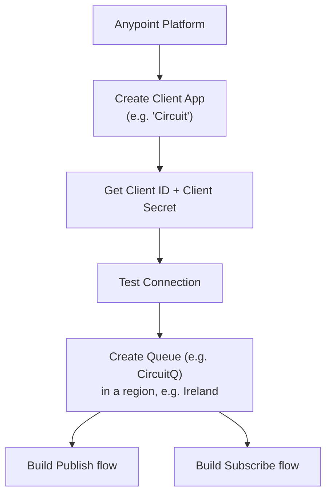
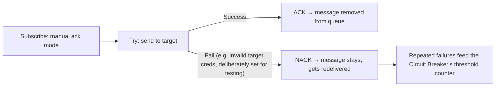
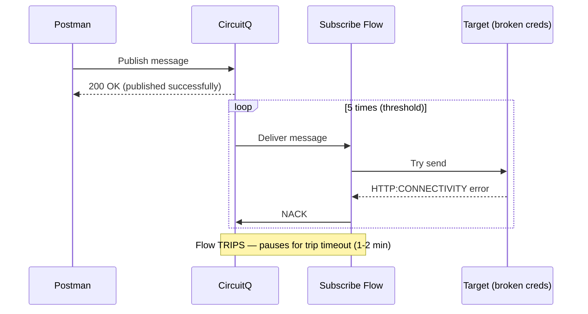
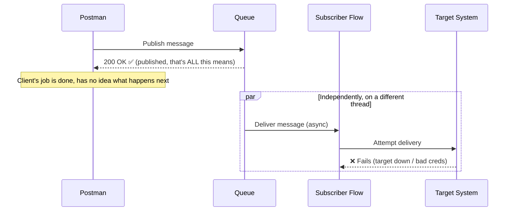
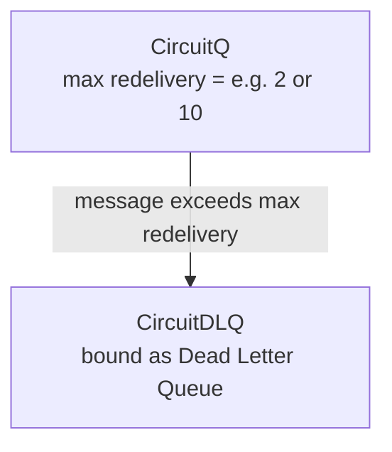

# Apr 18 — Detailed Notes: Circuit Breaker + DLQ — Full Hands-On Rebuild

> **Watch alongside:** everything from `apr01.md` (Circuit Breaker, DLQ) gets rebuilt **live, from an empty project**, on real Anypoint infrastructure. This is the session to actually follow along click-by-click in your own Studio — it turns the theory into muscle memory.

---

## 1. Setting Up Anypoint MQ From Scratch

- **Client App** credentials (Client ID + Secret) authenticate your MQ connector config — always **Test Connection** before moving on.
- **Publish flow:** `Listener → Logger → Publish (to CircuitQ)`
- **Subscribe flow:** `Subscribe (from CircuitQ) → Logger → Request (to target) → Logger`

### Queue vs. Exchange, applied practically (recap from `apr08.md`)
- Publish directly to a **Queue** → only that queue gets it.
- Publish to an **Exchange** → every queue **bound** to that exchange gets a copy — use this when multiple independent subscribers each need the same message.

### Other configuration notes
- **Purge** on a queue = delete **all** messages currently sitting in it — handy for resetting test state between runs.
- **Default ack mode = Auto.** Switch to **Manual** so the flow can explicitly ACK/NACK based on whether delivery to the target succeeded.

---

## 2. Target Variable, Applied Here (recap from `apr07.md`)

When the Request connector calls the target system, its response is set into a **Target Variable** (Advanced tab) rather than overwriting `payload` — this keeps the original MQ delivery **attributes/token** accessible separately from the target's response.

---

## 3. Manual ACK/NACK Logic

For this demo, the target's credentials were **deliberately broken** to force a real, repeatable `HTTP:CONNECTIVITY` error — this is the standard technique for testing Circuit Breaker behavior on purpose.

---

## 4. Configuring and Deploying the Circuit Breaker

| Setting | Value used |
|---|---|
| Error type | `HTTP:CONNECTIVITY` |
| Threshold | 5 |
| Trip timeout | 1–2 minutes (short, for fast testing) |

**Deployment steps:**
1. Package the app and deploy to **CloudHub** via **Runtime Manager** (upload the built artifact).
2. Trigger via Postman → publish a message to the queue.
3. Watch the **Runtime Manager logs**:
   - MQ token/ack details appear as the subscriber consumes each message.
   - `HTTP:CONNECTIVITY` failures logged — confirmed to occur **exactly 5 times** (matching threshold) before the flow **trips**.
   - After tripping, no further pickup attempts occur until the trip timeout elapses — verified by watching the timestamps in the logs.

---

## 5. ⭐ The Most Important Interview Insight From This Day: Async Decoupling

This is a subtlety worth internalizing deeply, because it's exactly the kind of "gotcha" question interviewers love.

**The scenario:** Postman gets a **200 OK** immediately after publishing to the queue. But the target system never actually received the data. Why?

**The answer:** the **200 OK only confirms the message was successfully accepted into the queue.** It says *nothing* about what happens afterward. Publishing and downstream delivery are **decoupled** — they happen on different threads, at different times, and the original caller (Postman/the source client) has **zero visibility** into what happens after the message enters the queue.

> 🧠 **How to answer this in an interview:** *"A 200 response confirms successful **publish to the queue**, not successful **end-to-end delivery**. The actual delivery failure — in this case an HTTP connectivity issue reaching the target — has to be diagnosed separately, by checking the Mule application's own logs (e.g. in Runtime Manager), since the publishing client has no way to know about it."*

---

## 6. Adding a Dead Letter Queue to This Same Project

- Create a new queue, e.g. `CircuitDLQ`.
- Bind it to `CircuitQ` as its **Dead Letter Queue**.
- Set **Max Redelivery Attempts** (tested with small values like 2, then discussed with 10 for clarity).

### Disambiguating Threshold vs. Max Redelivery — again, worked with real numbers

| | Circuit Breaker **Threshold** | DLQ **Max Redelivery Attempts** |
|---|---|---|
| Level | Whole **flow** | One specific **message** |
| Example value | 5 | 10 |
| What happens when hit | Flow **trips**, pauses for `trip timeout` | *That message* moves to the **DLQ** |

**Worked example (max redelivery=10, threshold=5):**
- The flow trips after the **5th** consecutive matching error — this happens *first*, since 5 < 10.
- A single message's own redelivery count keeps accumulating **across** multiple trips/resumes; only once *that specific message* individually reaches 10 redeliveries does it get pushed to the DLQ.
- These two counters run independently and serve different purposes: threshold protects the target system from being hammered repeatedly; max redelivery protects against one specific bad message looping forever.

> This is explicitly called out as one of the most confusing topics in the whole course if you only read about it instead of building it — which is exactly why this session rebuilds it hands-on.

---

## 7. Communicating This to a Non-Technical Stakeholder

Practiced framing for a realistic support conversation:
> *"The client received a 200 response because the message was successfully published to the queue — that part worked fine. The actual issue is downstream: we're seeing an HTTP connectivity error trying to reach the target system. So the problem is with the target system's availability, not with our integration."*

This kind of clear, precise translation — technical failure details → plain statement of what broke and where — is called out as a real, practical interview/on-the-job communication skill, not just a technical one.

---

## 8. Startup Interview Q&A Snippets (mentioned in this session)
- How do you design an API?
- What does **RAML** stand for? (covered fully in `apr25.md`)
- How do you deploy an application? (CloudHub / Runtime Manager)
- Difference between **vCore** and **Worker**?
- What connectors have you used? Why **SFTP** over **FTP**? → SFTP is the **secure**, encrypted variant.
- What's the biggest technical challenge you've faced, and how did you solve it?

---

## Quick Recap

- Full rebuild, from empty project: Anypoint MQ setup → Publish/Subscribe flows → Target Variable → manual ACK/NACK → Circuit Breaker (threshold=5, error=HTTP:CONNECTIVITY) → DLQ (max redelivery, separate counter from threshold).
- **The single most important idea:** a **200 OK** from a queue publish only confirms the message reached the **queue** — not that it reached the **target**. Async decoupling means the publishing client can never know about downstream failures on its own.
- Threshold (flow-level pacing) and Max Redelivery (message-level giving-up) are independent counters — know the difference cold, with worked numbers.
