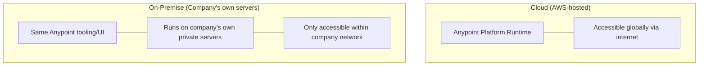
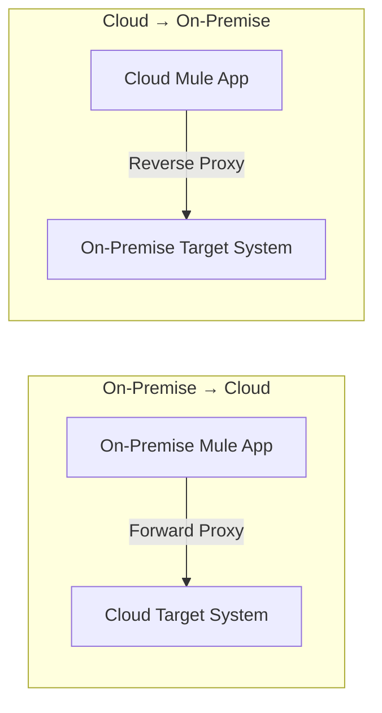
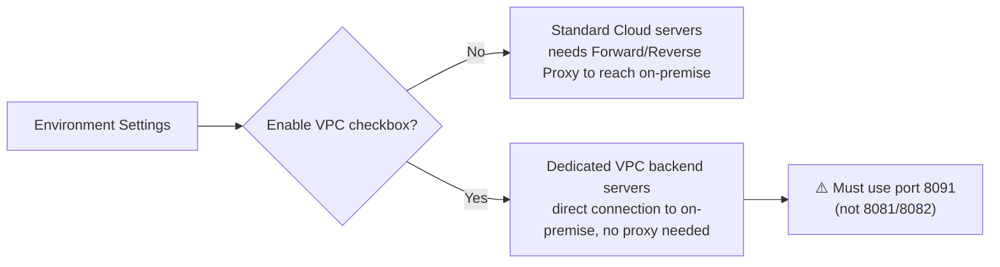

# Apr 21 — Detailed Notes: On-Premise vs Cloud vs VPC, Platform Access, Interview Coaching

> **Watch alongside:** a mostly-conceptual day (less hands-on coding, more architecture/interview literacy) — but it covers deployment-model knowledge that shows up constantly in interviews, and closes with genuinely useful mindset coaching on how to actually perform well in interviews.

---

## 1. Platform Access Management — Reality vs. Trial Account

On your personal trial Anypoint account, everything is unlocked. **Real organizations restrict this heavily** — access to Runtime Manager, API Manager, Anypoint MQ, Design Center, Exchange, and Monitoring is **admin-controlled**. If you need access to something, you request it from the platform admin.

---

## 2. Manual Deployment vs. Pipeline Deployment

| | Manual Deployment | Pipeline (CI/CD) Deployment |
|---|---|---|
| How | Build in Studio → manually upload JAR via Runtime Manager | Automated (e.g. Jenkins — full detail in `apr27.md`) |
| Speed | Fast | Slower (more steps) |
| Standards enforced | ❌ None automatically | ✅ Naming conventions, encryption, test coverage, etc. |
| Who uses it | Lower-maturity teams / no budget for tooling | Most real, mature organizations |

---

## 3. Cloud vs. On-Premise — The Core Distinction

| | Cloud | On-Premise |
|---|---|---|
| Hosted on | **AWS** (Anypoint Platform's own infrastructure) | The **company's own private server/network** |
| Accessibility | Global, via internet | Only within the **company's network** |
| Security model | Credential/platform-based | Network isolation — outside requests are blocked entirely |
| Typical use | New/modern development | **Legacy applications** — companies avoid migrating old, stable, business-critical systems due to risk/cost |
| Resource cost model | Pay for Worker/vCore (cloud billing) | Uses the company's own server capacity — no separate cloud billing concept |

> Note: the tooling and UI (Anypoint Platform, Design Center, etc.) look identical either way — the difference is purely **where the runtime actually executes**.

---

## 4. Connecting Cloud ↔ On-Premise: Firewalls and Proxies

On-premise systems reject unrecognized traffic by default — a **firewall** only allows requests from **whitelisted URLs** through.

| Direction | Proxy type |
|---|---|
| **On-premise → Cloud** | **Forward Proxy** |
| **Cloud → On-premise** | **Reverse Proxy** |

- A proxy/firewall here acts as a **controlled pass-through layer** — it doesn't modify the data, it just decides (based on whitelisted URLs) whether to let a request through.
- This configuration is typically owned by **DevOps/network teams**, not the Mule developer — but interviewers expect you to know the correct terminology and which direction needs which proxy type.

---

## 5. VPC (Virtual Private Cloud) — MuleSoft's Shortcut Around Proxies

Introduced by MuleSoft (~2.5 years before this recording) specifically to skip the proxy/firewall dance above.

- Enabling VPC (a checkbox in environment settings) changes **which backend server pool** your app deploys to — those VPC servers can connect directly to on-premise systems without proxies.
- **Critical gotcha:** apps in a VPC environment **must** use port **8091** for their HTTP listener. Using 8081/8082 instead causes a **502 Bad Gateway** error — a very specific, memorable symptom to know for both debugging and interviews.

### Practical takeaway
> Always find out — from your team, on day one of a project — whether your organization's Anypoint setup is **Cloud**, **VPC**, or **On-Premise**. It directly determines: (a) whether you need proxies at all, and (b) which port convention to use.

---

## 6. DataWeave Exercise Recap (interview mock)
Reinforced the same category of `map`/`filter` exercise as `apr08.md`/`apr11.md` — the recurring correction: when the requirement expects a filtered/mapped **array** of results, the output must remain an **array**, not collapse into a single object.

---

## 7. Interview Confidence Coaching (the most transferable part of this day)

Core message: **you don't need to know everything — you need to explain what you actually know, thoroughly and confidently.**

- No interviewer expects 100% correct answers across the board — different engineers have different exposure (some know Salesforce, some NetSuite, etc.), and that's completely normal.
- What actually builds interviewer confidence is **depth on what you've genuinely practiced**: if you've used Anypoint MQ, Pub/Sub, and Circuit Breaker, explain them **in real depth** — architecture, gotchas, worked examples — rather than reciting a one-line definition.
- Don't chase breadth to impress; **chase depth on your actual hands-on experience.**

> This mindset generalizes well beyond MuleSoft interviews — it's a genuinely useful reframe for any technical interview.

---

## Logistics
- Remaining course topics: **RAML** (next, `apr25.md`), **Fragments**, **Bitbucket**, **Jenkins** (`apr26.md`/`apr27.md`) — closing out the training.
- Reminder: the personal Anypoint trial org has a limited access window (~20 days) — use it to practice MQ and other platform features while it's still available, since most real company environments won't expose everything as freely to a trainee.

---

## Quick Recap

- **Cloud** = AWS-hosted, globally accessible. **On-Premise** = company's own server, network-isolated. **VPC** = MuleSoft's way to connect directly to on-premise without proxies, but forces **port 8091**.
- **On-premise → Cloud** needs a **Forward Proxy**; **Cloud → On-premise** needs a **Reverse Proxy**.
- Interview mindset: depth on what you've actually done beats trying to sound broad on everything.
