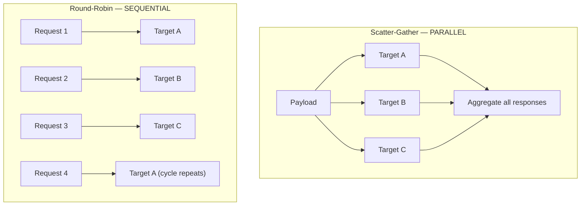
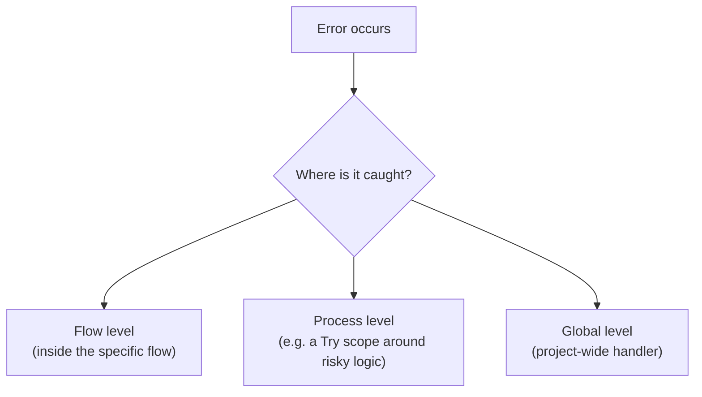
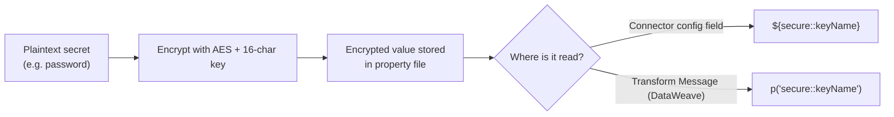
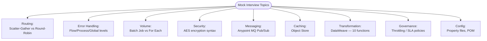

# Apr 22 — Detailed Notes: Full Interview Rapid-Fire Recap

> **Watch alongside:** this day is a consolidation checkpoint — short on new mechanics, dense on interview-ready explanations tying together everything from Apr 01–Apr 21. Treat this file as your master cheat sheet; every row links back to where the concept was originally built hands-on.

---

## 1. Quick Warm-Up (Session 1 — short clip)
- MuleSoft's purpose: **integrating applications/systems**, not building applications from scratch.
- The Mule IDE is **Anypoint Studio**.
- The course uses **Mule 4**.

---

## 2. Scatter-Gather vs. Round-Robin

- **Scatter-Gather**: same payload sent to **multiple targets in parallel**, then all responses are aggregated together.
- **Round-Robin**: requests are distributed **one at a time, cycling** through a list of targets sequentially — good for basic load distribution.

---

## 3. Error Handling Levels — Full Picture

Three places error handling can live:

Two behaviors for a **global** handler:

| Handler type | Behavior | HTTP status returned |
|---|---|---|
| **On Error Continue** | Flow **continues** past the error | **200** |
| **On Error Propagate** | Flow **stops/trips** | **500** |

> **Best practice reinforced:** global handling alone is **not sufficient**. Combine it with **process-level** handling (e.g. wrap risky logic in a **Try** scope) for real coverage. Recommended structure: **two main flows** — one holding the primary logic, one acting as a process-level wrapper.

*(Full hands-on MUnit testing of both the happy path and the error path lives in `apr08.md` and `apr11.md`.)*

---

## 4. Batch Job vs. For Each — the one-table version

| | For Each | Batch Job |
|---|---|---|
| Threading | Single-threaded | **16 threads** (default) |
| Execution | Sequential | Parallel |
| Default block size | 1 | 100 (customizable) |
| Stages | — | Batch Step → Batch Job → On Complete |
| Best for | Small volumes | Large volumes (lakhs/millions) |
| Speed example | ~1M records: **over an hour** | ~1M records: **2–3 minutes** |

*(Full explanation and hands-on tasks: `apr13.md`.)*

---

## 5. Securing Sensitive Data — Encryption Syntax (new detail this session)

Passwords/secrets in property files are encrypted using an algorithm like **AES**, with a secure key (example: a 16-character key).

| Context | Syntax |
|---|---|
| Reading an **encrypted** value in a connector config field | `${secure::keyName}` |
| Reading an **encrypted** value inside Transform Message (DataWeave) | `p('secure::keyName')` |
| Reading a **normal (non-encrypted)** property value | `${keyName}` |

> 🧠 This exact syntax distinction (`secure::` prefix + which function/placeholder style applies where) is a precise, easy-to-test interview question — memorize it verbatim.

---

## 6. Notifications, MQ, Object Store — Rapid Recap Table

| Topic | Key fact | Full detail |
|---|---|---|
| Email/Notification connector | Used to trigger email alerts | — |
| Anypoint MQ | Async Pub/Sub model; Queue = 1-to-1, Exchange = 1-to-many | `apr01.md`, `apr08.md` |
| Object Store | FIFO-like; max 30 days; **Persistent** flag prevents data loss on app downtime; consumes runtime memory | `apr07.md`, `apr08.md` |

---

## 7. DataWeave Functions — The Must-Know-10 List

Interview framing: **failing to explain Transform Message functions is called out as a likely reason to not get selected.** Minimum list to have cold:

| # | Function | What it does |
|---|---|---|
| 1 | `map` | Reshape every item in an array |
| 2 | Range (`[0 to 3]`) | Extract a sub-range/substring |
| 3 | `sizeOf` | Count items in an array/string length |
| 4 | `splitBy` | Split a string into an array by delimiter |
| 5 | `replace` | Replace matching text |
| 6 | `pluck` | Extract values (and optionally keys) from an object into an array |
| 7 | `flatten` | Collapse nested arrays into one flat array |
| 8 | Date functions | Format/parse/manipulate dates |
| 9 | `filter` | Keep only items matching a condition |
| 10 | `distinctBy` | Remove duplicates based on a field |

---

## 8. Throttling, SLA Policies, Property Files, POM

- **Throttling / Rate Limiting / SLA-based policies** can be tested **internally via MUnit**, rather than only through live calls against a real gateway.
- **Property files** can be read dynamically, including pointing to different property files per environment (dev/test/prod).
- **POM file** — holds the project's **Maven dependencies**.

---

## 9. Mind-Map: Everything Tested in This Mock Interview

---

## Quick Recap

- This day doesn't introduce brand-new mechanics — it's a **rehearsal**: fluently explaining Scatter-Gather/Round-Robin, all 3 error-handling levels, Batch/For Each, AES property encryption syntax, MQ, Object Store, and 10 DataWeave functions is described as **more than enough to pass a ~25-minute interview**.
- The single new concrete detail worth memorizing precisely: the `${secure::keyName}` vs. `p('secure::keyName')` vs. `${keyName}` syntax table.
- Remaining course topics after this: **Fragments** (important, don't skip — `apr25.md`), **Bitbucket**, **Jenkins** (`apr26.md`/`apr27.md`).
