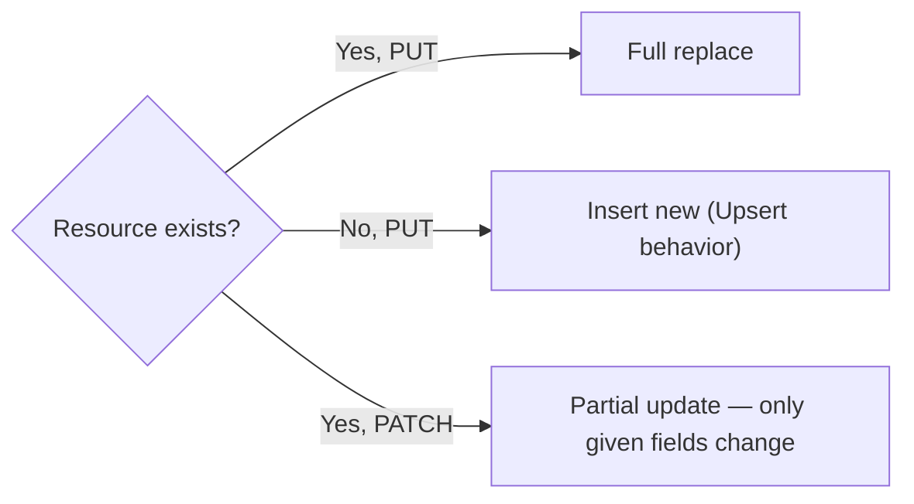
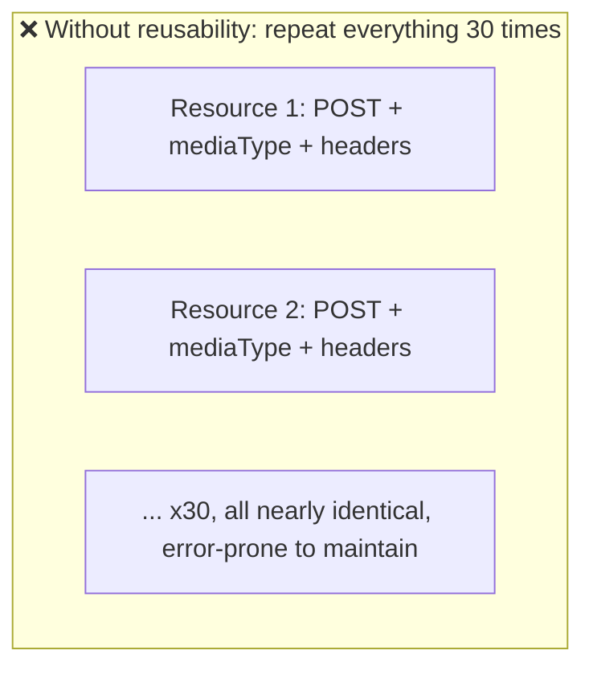
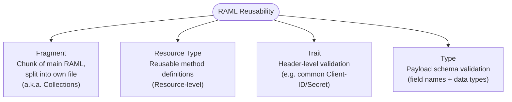
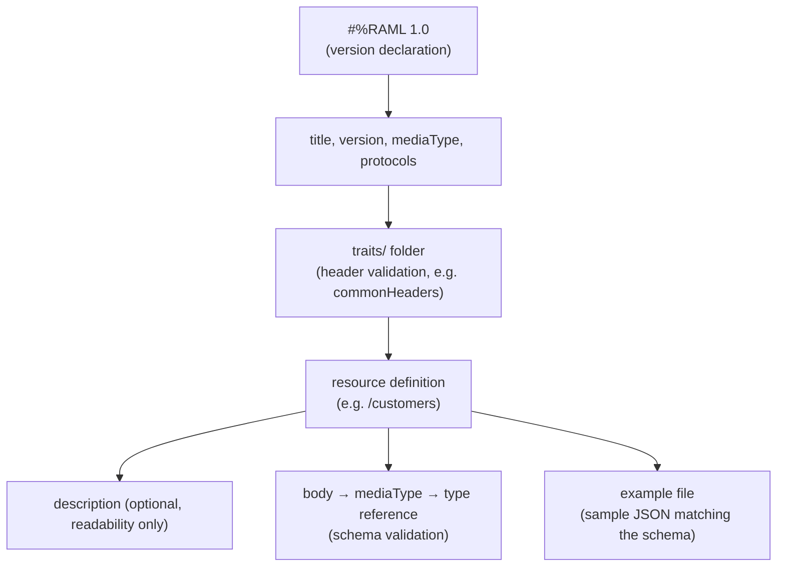
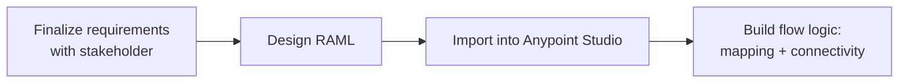

# Apr 25 — Detailed Notes: HTTP Methods + RAML (Fragments, Resource Types, Traits, Types)

> **Watch alongside:** the single most "interview trivia dense" day in the course — the 4 core RAML reusability/validation concepts (Fragments, Resource Types, Traits, Types) sound similar and are easy to mix up. This file is built to make each one visually distinct so you stop confusing them.

---

## 1. HTTP Methods — Precise Definitions

| Method | Purpose | Notes |
|---|---|---|
| **GET** | Retrieve data | No body needed |
| **POST** | Create new data | |
| **PUT** | **Full update** of a resource | Can also **insert** if the resource doesn't exist — this "update-or-insert" behavior is called an **Upsert** |
| **PATCH** | **Partial** update of a resource | Only the fields provided are changed |
| **DELETE** | Remove data | |



> **Upsert** = "**up**date or in**sert**" — the term for PUT's dual behavior when there's no existing record to update.

---

## 2. Why RAML Needs Reusability Constructs — The Motivating Problem

**Scenario:** an API needs **30 resources**. All 30 need to accept `POST`, the same media type, and similar header/body validation.


Repeating this configuration 30 times is wasteful and a maintenance nightmare — change one detail, and you have to hunt down and fix it 30 times. RAML solves this with four distinct reusability/validation mechanisms.

---

## 3. The Four Core RAML Concepts — Side by Side

| Concept | Solves | Reused via | Level |
|---|---|---|---|
| **Fragment** (a.k.a. "Collection") | Reusing an entire **chunk of the RAML file**, split into its own file | `!include` | File-level |
| **Resource Type** | Reusing a **method definition** across many resources | `type: <name>` | Resource-level |
| **Trait** | Reusing **header-level validation** | `is: [<name>]` | Header-level |
| **Type** | **Payload/schema validation** (field names + data types) | `type:` in a `body` schema | Data-level |



### 3a. Fragments (a.k.a. "Collections")
The general mechanism: instead of repeating a block inline many times, save it once in its **own file**, and reference it from the main RAML. Interviewers sometimes say **"Collections"** instead of "Fragments" — same concept, different word.

### 3b. Resource Types — reuse a *method*
Use case: many resources all need the same `POST` behavior. Define it once:
```raml
resourceTypes:
  postable:
    post:
      body:
        application/json:
          type: CustomerRequest
```
Then apply it to any resource:
```raml
/customers:
  type: postable
```
> Only needed for **multi-resource** APIs — a single-resource API can just declare its method inline without a Resource Type.

### 3c. Traits — reuse *header validation*
Use case: common required headers (`Client-ID`, `Client-Secret`) needed across many resources.
```raml
traits:
  commonHeaders:
    headers:
      Client-ID:
        required: true
      Client-Secret:
        required: true
```
Apply via `is`:
```raml
/customers:
  is: [commonHeaders]
```
- `required: true` → the header/field is mandatory.
- A trailing **`?`** on a key name → marks it **optional** (equivalent to `required: false`).

### 3d. Types — reuse *payload schema validation*
Validates the **actual JSON structure and data types**, not just headers/methods:
```raml
types:
  CustomerRequest:
    type: object
    properties:
      projectId:
        type: integer
        required: true
      projectName:
        type: string
      projectNumber:
        type: string
      salesforceOpportunityId:
        type: string
```

---

## 4. Error Codes — Know Which Is Which

| Situation | Status Code |
|---|---|
| Wrong **HTTP method** used (e.g. DELETE where only GET/POST are allowed) | **405 Method Not Allowed** |
| Payload **fails schema validation** (missing field, wrong type) | **400 Bad Request** |

**String vs. number in JSON/RAML examples:** double-quoted values are **strings**; unquoted numeric values are **integers/numbers**.
```json
{ "projectId": 123, "projectName": "Alpha" }
```
`projectId` (no quotes) = integer. `projectName` (quotes) = string.

---

## 5. A Real RAML File, Section by Section



Top-level fields:
- `baseUri` — mainly relevant for **mock service enablement**.
- RAML version, `title`, `version`, `mediaType` (e.g. `application/json`), `protocols` (e.g. `HTTPS`).
- A **traits** folder with header-validation rules.
- Each resource: optional `description` (documentation only, not mandatory) → `body` → `mediaType` → schema reference (a **Type** file) → an **example** file with sample matching JSON.

---

## 6. API Design Discipline — Requirements Before RAML

Before writing any RAML, get **explicit confirmation** from the business/source stakeholder on:
- Final API name and resource names (don't finalize unilaterally).
- Exact expected fields and their **data types**.
- Which fields are **mandatory** vs. **optional** (drives `required: true` vs. `?`).
- Whether every field from the **source** system actually needs to reach the **target** — extra fields can be filtered out during transformation.
- **Connectivity pattern** to both source and target — API-based? Something else? This shapes integration design early.



> Process hygiene: track every requirement confirmation via **email or a Jira/Scrum board** — don't rely on verbal-only agreements.

---

## Quick Recap

- **PUT** = full update (can Upsert); **PATCH** = partial update.
- **Fragment** = reusable file chunk. **Resource Type** = reusable method. **Trait** = reusable header validation. **Type** = payload schema validation. Different levels, easy to mix up — use the table above to keep them straight.
- **405** = wrong method. **400** = bad/invalid payload.
- Always confirm API name, fields, types, required/optional, and connectivity pattern with the business **before** writing RAML.
- Next: **Bitbucket** (`apr26.md`) — install a Bitbucket account and Git Bash before that session.
