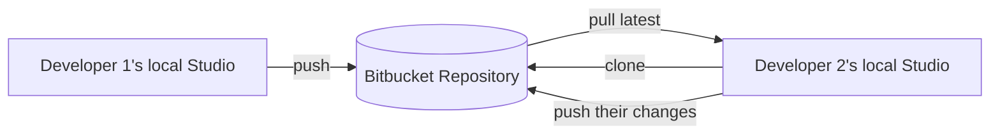
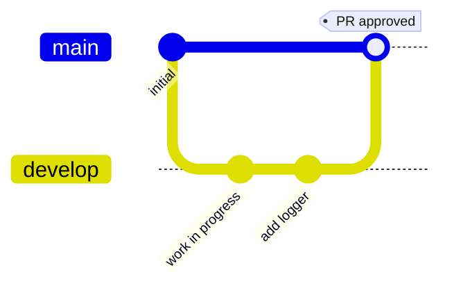
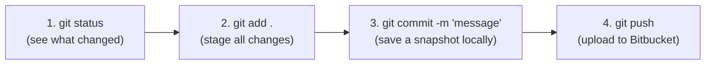
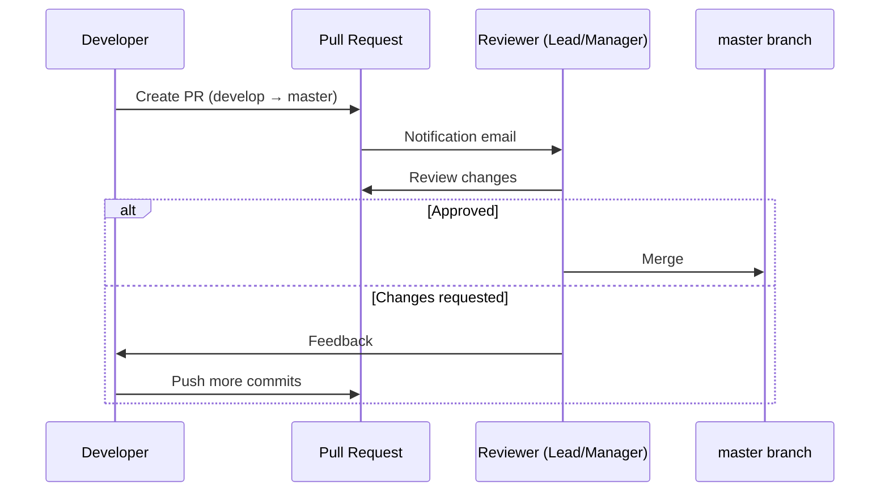

# Apr 26 — Detailed Notes: Bitbucket, Git Workflow, Pull Requests

> **Watch alongside:** the course's first non-Mule-specific topic — Git/Bitbucket fundamentals that apply to *any* software job. If you've never used Git before, this is the day to actually type every command yourself rather than just watching.

---

## 1. Why a Code Repository Exists (the motivating story)

**Scenario:** two developers are collaborating on the same client project. One suddenly goes on leave. Where is their unfinished work? If it only lives on their local machine, the team is stuck — no one else can pick it up.

**A code repository (Bitbucket, GitHub, GitLab) fixes this by being the single shared source of truth:**



- Anyone can **clone** the shared code and continue work — no single point of failure.
- Every change is **tracked**: who added what, and when (via commits and Pull Requests).
- Enables real **code review** via Pull Requests before anything is merged.

> This is universal software-industry practice — applies to Java, .NET, Python, Mule, anything.

---

## 2. Branching Model



- Every new (empty) repository starts with a single default branch: **`master`** (sometimes called `main`).
- **Industry convention: `master` holds production-ready code ONLY.**
- New/untested work goes on a separate branch first — e.g. **`develop`** — until it's ready to be reviewed and merged.
- A new branch, when created, **starts as an exact copy** of whichever branch it was branched from.

---

## 3. Hands-On: Setting Up and Cloning

1. Create an **empty repository** in Bitbucket (e.g. named `dummy`). Note: the local project name and the Bitbucket repo name don't need to match.
2. Create a `develop` branch via Bitbucket's UI (Branches → Create branch).
3. Locally, create an empty folder, open **Git Bash** in it, and clone the specific branch:
   ```bash
   git clone -b develop <repository-URL>
   ```
   - The `-b` flag specifies which branch to pull — omitting it defaults to `master`, which should stay empty/production-only for now.
   - You'll be prompted for Bitbucket credentials (an app password may be required, not your normal login password).

---

## 4. The Core Git Push Workflow — 4 Commands to Memorize

After making a change (e.g. adding a Logger to your Mule flow):



| Step | Command | What it does |
|---|---|---|
| 1 | `git status` | Shows changed files — typically **red** for unstaged/untracked |
| 2 | `git add .` | Stages **all** changed files for commit — re-checking `git status` now shows them **green** |
| 3 | `git commit -m "message"` | Commits staged changes **locally**, with a descriptive message |
| 4 | `git push` | Uploads the local commit to the remote Bitbucket branch |

After pushing, Bitbucket's **Commits** view shows the full diff history — additions/removals highlighted, along with who made each change and when.

---

## 5. Continuing a Teammate's Work — the Real Payoff

Full loop demonstrated: Person A pushes code → Person B **clones the same branch**, imports it into **Anypoint Studio**, adds their own change (another Logger), and pushes again using the same 4-command flow.

- To bring in someone else's newly-pushed changes before continuing locally: sync your local `src` folder with the freshly cloned version, then keep editing and repeat add → commit → push.
- **This is the entire point of a shared repo:** anyone can pick up exactly where another person left off, with full history of who changed what and why.

### Task Assigned
1. Create a Bitbucket account.
2. Create a dummy project in Anypoint Studio.
3. Push it to Bitbucket.
4. Clone it again (simulating a teammate picking it up).
5. Add one more change (e.g. a Logger).
6. Push again.

---

## 6. Pull Requests (PRs) — Merging Safely

You never push directly into `master`. Instead, you merge via a **Pull Request** — a reviewed, controlled merge from one branch into another (e.g. `develop` → `master`).



**Steps:** Bitbucket → **Pull Requests → Create Pull Request** → select source branch (`develop`) and destination branch (`master`) → assign **reviewers** (e.g. a lead or manager, which typically triggers a notification email) → reviewer inspects and either **approves & merges**, or requests changes.

> This review gate before merging into `master` is standard practice — it's the mechanism that ensures only reviewed, tested code ever reaches the production branch.

---

## Quick Recap

- Repositories exist to enable **collaboration + tracking + continuity** when work is shared across people.
- Branch convention: **`master`/`main` = production only**; use `develop` (and later `feature` branches, see `apr27.md`) for in-progress work.
- Memorize the 4-command push loop: `git status` → `git add .` → `git commit -m "..."` → `git push`.
- **Pull Requests** are the reviewed gateway for merging `develop` into `master` — never push directly to `master`.
