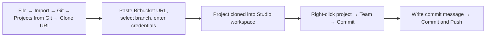
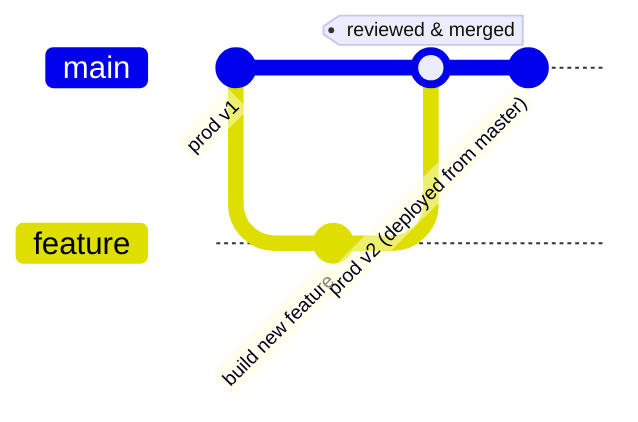
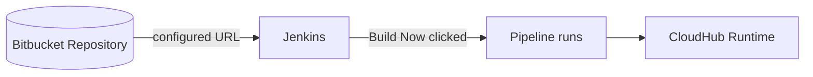
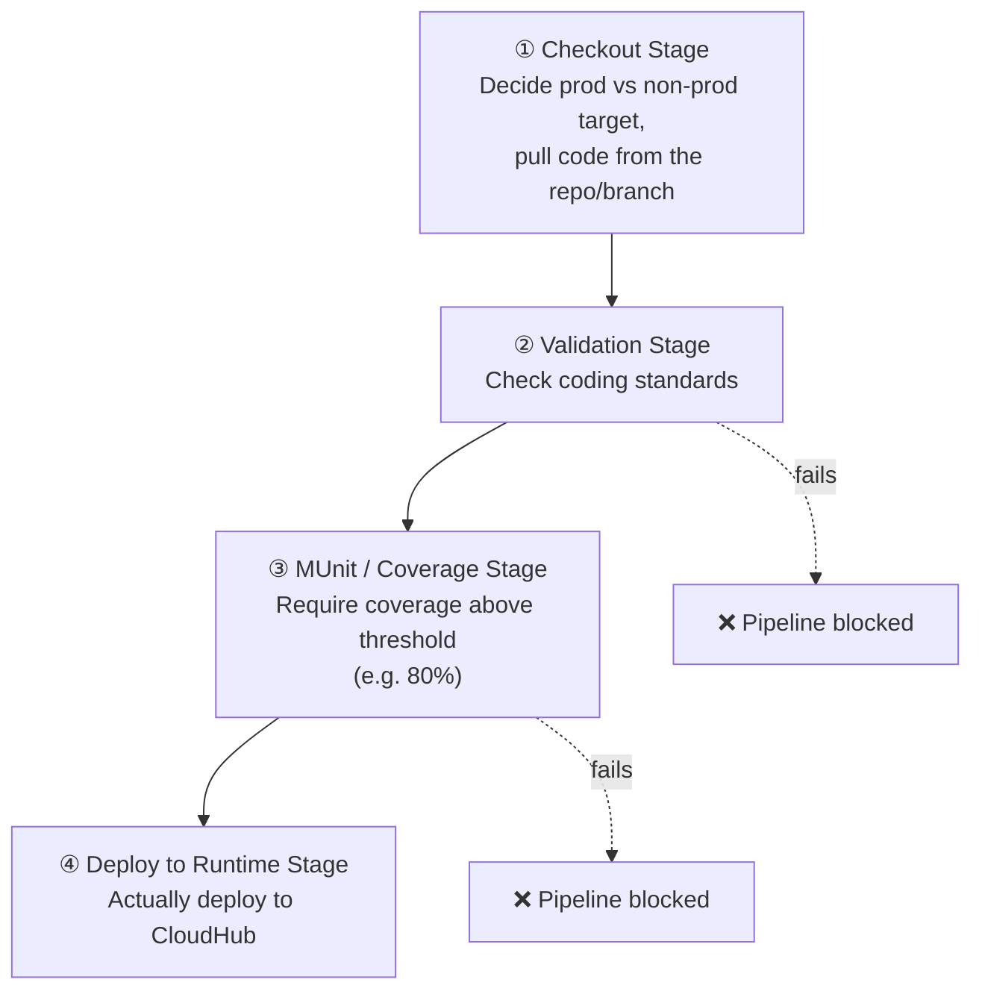
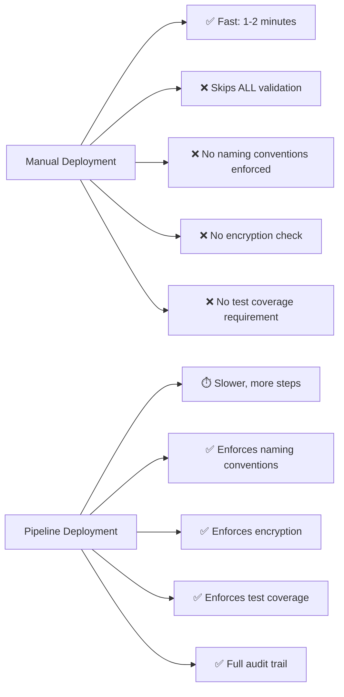

# Apr 27 — Detailed Notes: Jenkins CI/CD Pipeline + Course Wrap-Up

> **Watch alongside:** the final technical topic of the course — how code actually gets from Bitbucket into a running CloudHub deployment via an automated pipeline. Then a wrap-up covering resume-building, a new self-study topic (Solace), and certification advice.

---

## 1. Two Ways to Work with Git Inside Anypoint Studio

**Option A — Studio's built-in Git integration:**

- Requires the **Git/EGit plugin** — if missing: `Help → Install New Software → search "EGit"`.

**Option B — Git Bash commands** (from `apr26.md`): `git status → git add . → git commit -m "message" → git push`.

> Both achieve the same result — pick whichever fits your workflow.

---

## 2. Branch Strategy — Adding `feature` Branches

- A new branch created from `master` **inherits whatever code is currently in `master`** at that moment — a snapshot, not a live link.
- Confirmed practice: **`master` always holds the latest production-deployed code.**
- A **`feature`** branch is used to build a specific new feature in isolation, before merging back via PR.

---

## 3. Access Control in Real Organizations (reinforced)

In an actual company, you typically **won't** have unrestricted access to: cloning code, pushing code, merging branches, raising PRs, or creating new branches/repositories. Large orgs may have **hundreds of projects** in Bitbucket — a dedicated **admin team** manages who gets access to what. Request access as needed rather than assuming it.

---

## 4. Jenkins — What It Is and How It Fits

- **Jenkins** = a CI/CD (Continuous Integration / Continuous Deployment) tool — automates getting code from a repository into a running deployment.
- **Not Mule-specific** — deploys any codebase, using scripts written in Groovy, Java, Python, etc.
- **Connection:** Jenkins is configured with your Bitbucket repo URL, linking the two systems.
- **Triggering a deploy:** open the relevant pipeline in Jenkins → click **"Build Now"** → Jenkins pulls the latest code from the configured branch and deploys it to the target runtime (e.g. CloudHub).

> As a Mule developer, you typically **won't write the Jenkins scripts yourself** (owned by DevOps) — but understanding what each stage checks is a very common interview topic.

---

## 5. The 4-Stage Jenkins Pipeline — Full Detail

### Stage ② Validation — exactly what gets checked
- **Sensitive information is encrypted** in property files (no hardcoded plaintext passwords/secrets — recall the `${secure::keyName}` syntax from `apr22.md`).
- **Proper naming conventions** on every component — no leftover default names. Example: a Logger should be renamed to reflect what it actually logs (e.g. *"Logging Payload"*, *"Setting Tracking ID"*), not left as the generic default "Logger" / "Set Variable".
- **No commented-out (dead) code** left in any flow.
- **No unused components** left in the project.
- Failing **any** of these checks **fails the pipeline right here** — deployment never proceeds.

### Stage ③ MUnit / Code Coverage
- Requires MUnit test **coverage above an org-defined threshold** — commonly cited example: **80%** (varies by org, roughly 60–90%).
- Below threshold → pipeline **blocks deployment**.
- *(Full MUnit build process: `apr08.md` and `apr11.md`.)*

### Stage ④ Deploy to Runtime
- Only reached once **all** prior stages pass — this is where the app is actually pushed to CloudHub.

---

## 6. Manual Deployment vs. Pipeline — the Contrast, One More Time

> **Reality check from the instructor:** roughly 90% of organizations use a Jenkins-style pipeline, but manual deployment is still seen at some (typically smaller/less mature) organizations — you should be able to explain both, and articulate *why* pipelines are considered the better practice.

---

## 7. Interview Framing for This Whole Topic
Be ready to name and explain, in order: **Checkout → Validation → MUnit/Coverage → Deploy**, plus the branch strategy (**`master`** = production, **`develop`**/**`feature`** = in-progress work) — even though the pipeline scripts themselves are usually a DevOps responsibility, not something you write day-to-day.

---

## 8. Course Wrap-Up

### Mentorship & Practice Guidance
- Recommended pace: **4–5 hours/day** hands-on practice, aiming to close any recording gap within about a week.
- Once confident, message the instructor for a **mock interview** — used both to assess readiness and to identify specific lagging concepts — and for help **building a resume** based on demonstrated skills.
- Bring **specific, refined questions** back after group discussion, rather than vague "explain it all again" requests.

### Project Explanation Strategy
The instructor provides a **common project narrative** every trainee can use consistently when explaining "their" project in interviews, tailored to match each person's resume — ensuring everyone can speak fluently and specifically about a concrete design/flow.

### New Self-Study Topic: Solace (alternative to Anypoint MQ)

| | Anypoint MQ | Solace |
|---|---|---|
| Message-level control | Limited — can't finely control at queue level | More granular control at the queue level |
| Max payload | 10 MB | Larger payloads supported |
| Connector | Native Anypoint MQ connector | **JMS connector** |

**Task:** independently explore Solace — try creating a queue and publishing a message to it, mirroring the earlier Anypoint MQ hands-on practice.

### MuleSoft Certification — Time-Sensitive Advice
- The certification exam is **free**.
- Its question set reportedly refreshes periodically (roughly every few months per the instructor) — recommendation: attempt it **soon**, while the current syllabus (which recent batch members have already passed with) is still active, rather than risk having to re-learn updated material later.

---

## Quick Recap

- **Jenkins pipeline, 4 stages:** Checkout → Validation (naming, encryption, no dead code) → MUnit/Coverage (e.g. ≥80%) → Deploy to Runtime.
- Branch strategy: `master`/`main` = production; `develop`/`feature` = in-progress work, merged via reviewed Pull Requests.
- Manual deployment is fast but skips every safety check; pipelines are slower but enforce real engineering standards — know the tradeoffs cold.
- Self-study follow-ups: **Solace** (alternative MQ, more queue-level control, larger payloads, via JMS) and the **free MuleSoft certification** (time-sensitive — do it soon).
